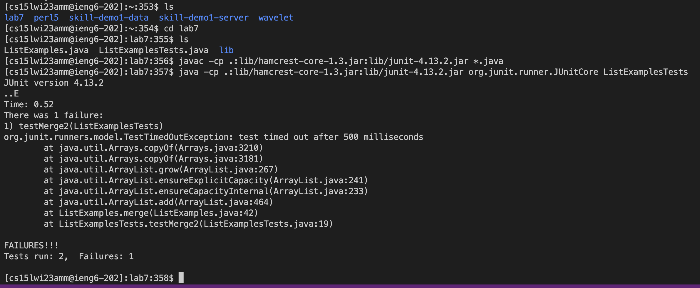

# CSE 15L Week 7 Lab Report by *Addy*

## Practice with editing a file in `nano` and using `git`

These instructions assume you have followed the steps for generating an `SSH key` for `ieng6` and generating an `SSH key` for GitHub. This will make committing and pushing to GitHub easier. If you haven't, the instructions to do so can be found on the CSE 15L website for Week 7 at: [Lab 7](https://ucsd-cse15l-w23.github.io/week/week7/#github-and-login-command-line-setup)

For the Labs Done Quick challenge, there are 9 steps.

## Steps 1-3
---
For step 1, make sure that there are no existing forks of Lab 7 in your own GitHub account's repositories. Then, make a fresh fork of the repo at: [Lab 7](https://github.com/ucsd-cse15l-w23/lab7). This completes the setup for the lab. Now start your timer!

## Step 4: Log into ieng6
---
To log into your ieng6 account, the format of your email should be: `cs15l[quarter][year][uniqueID]@ieng6.ucsd.edu`.
For example, mine is: `cs15lwi23amm@ieng6.ucsd.edu`.
The command is: `ssh [email]`

Keys pressed: 
* Open terminal: ``<CTRL><`>`` at the same time
* `ssh <space> cs15lwi23amm@ieng6.ucsd.edu`

`ssh` is used to log into the remote server. 
> Since I am on MacOS, I didn't have to change my terminal. If you're on Windows, you may have to change your terminal to `Git Bash` in order to login with `ssh`. I didn't have to enter a password due to the initial steps for generating SSH keys.

## Step 5: Clone your fork of the repository from your Github account
---
To clone the repository, go to your fork of [Lab 7](https://github.com/ucsd-cse15l-w23/lab7). Click the green button that says `<> Code` and copy the **SSH** clone link under the **local** tab. It should look like this: `git@github.com:[Username]/lab7.git`

Then return back to your terminal. Enter the clone command: `git clone` followed by the copied link.

Keys pressed:
* `git <space> clone <COMMAND>V <enter>` `<COMMAND>V` pastes the copied link. `<CTRL>V` if on Windows.

`git clone` Clones the repo into the remote server. Since we used the SSH cloning link, we are able to easily commit and push changes from the terminal.

## Step 6: Run the tests, demonstrating that they fail
---

Keys pressed:
* `ls` to show files and folders
* `cd <space> lab7` to change current working directory to the cloned lab 7
* `ls`
* `<CTRL>R javac <enter>` Since I've already run the tests before, I could access it with **reverse-i-search**.
* `<CTRL>R java <space> <enter>`

`<CTRL>R` is the command for **reverse-i-search**, which I used to find the commands in my history to compile and run the tests as I have ran them before.
* The command for compiling the files and tests is `javac -cp .:lib/hamcrest-core-1.3.jar:lib/junit-4.13.2.jar *.java`.
* The command for running the test is `java -cp .:lib/hamcrest-core-1.3.jar:lib/junit-4.13.2.jar org.junit.runner.JUnitCore ListExamplesTests`.

## Step 7: Edit the code file to fix the failing test
---

Keys pressed:
* `nano <space> ListExamples.java` to open nano
* Once in the nano screen: Flick trackpad upwards until you reach the bottom of the file.
* `<up><up><up><up><up><up><up>, <right><right><right><right><right><right><right><right><right><right><right><right>, <backspace> 2` to change `index1` to `index2`
* `<CTRL>O <enter> <CTRL>X`

`nano [file]` opens the `nano` screen for a desired file, which allows the user to edit the file from the terminal. `<CTRL>O` saves the edits. `<CTRL>X` exits out of `nano`.

## Step 8: Run the tests, demonstrating that they now succeed
---

Keys pressed:
* `<CTRL>R javac <enter>`
* `<CTRL>R java <space> <enter>`

I repeated the steps from step 6 to compile and run the testing files.

## Step 9: Commit and push the resulting change to your Github account
---

Keys pressed:
* `git <space> add <space> ListExamples.java`
* `git <space> commit <space> -m <space> "Updated"`
* `git <space> push`

`git add` adds a desired file to be committed to the repository. `git commit -m` essentially locks in your changes locally from `git add` to later be pushed to the repository. `git push` sends the committed changes from your computer (`in this case, the remote server`) to the online repository at GitHub.
> This will only work if you properly followed the setup instructions of generating an SSH key.

As you can see, the file has been updated on the GitHub website.

