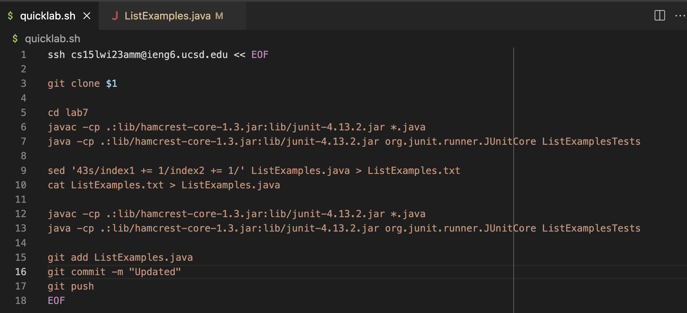
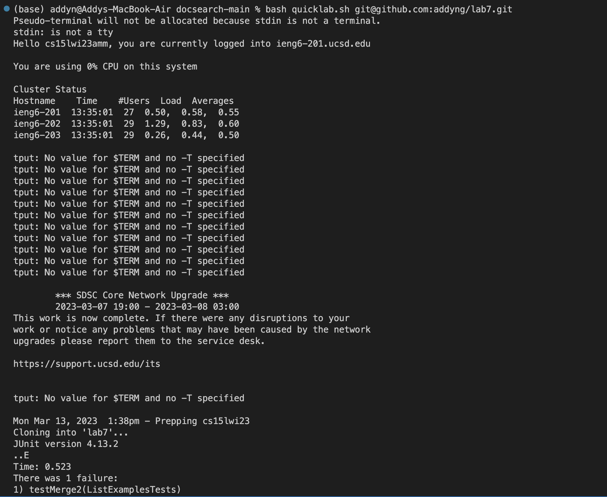
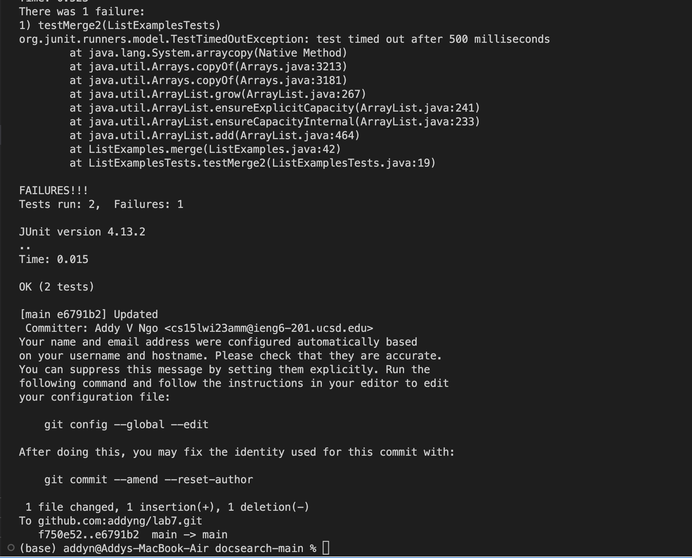

# CSE 15L Week 9 Lab Report by *Addy*

## Labs Done Quick with a bash script

The bash script I wrote is:
---
To run the bash script in the terminal, I used the command `bash quicklab.sh git@github.com:addyng/lab7.git`.


The result of running the script is:
---




As you can see, the script went through all the steps and the changes appeared on my GitHub repo, changing `index1 += 1` on Line 43 to `index2 += 1`.

## Explanation of the script
---

## Steps 1-3
---
Steps 1-3 was done manually. I deleted the existing fork on my GitHub account and the existing `lab7` directory on my `ieng6` account. The repo can be found at [Lab 7](https://github.com/ucsd-cse15l-w23/lab7).

## Step 4: Log into ieng6
---
This is done by the line `ssh cs15lwi23amm@ieng6.ucsd.edu`. An important thing to note is the `<< EOF` and corresponding `EOF`. When I was writing the script, I ran into an issue of it not running the commands below the `ssh` command in the remote server. Instead, it only ran the commands on my local terminal, after I logged out of the remote server. According to the [source](https://stackoverflow.com/questions/45608019/bash-script-that-will-continue-execution-on-a-remote-server-after-sshing-onto-i) below, `EOF` is called a "[here-doc](https://phoenixnap.com/kb/bash-heredoc#:~:text=A%20HereDoc%20is%20a%20multiline,neater%20and%20easier%20to%20understand.)". The code inside of the here-doc is viewed as a separate file to run commands on the remote server.

## Step 5: Clone your fork of the repository from your Github account
---
This is done by the line `git clone $1`. The `$1` takes in the SSH clone link from `bash quicklab.sh git@github.com:addyng/lab7.git` as a command-line argument, so the `git clone` command is ran as `git clone git@github.com:addyng/lab7.git`.

## Step 6: Run the tests, demonstrating that they fail
---
This step was done with the code:
```
cd lab7
javac -cp .:lib/hamcrest-core-1.3.jar:lib/junit-4.13.2.jar *.java
java -cp .:lib/hamcrest-core-1.3.jar:lib/junit-4.13.2.jar org.junit.runner.JUnitCore ListExamplesTests
```
First, I have to `cd` into the cloned `lab7` directory in order to access the java files. Since I'm using a bash script, I don't need to find the compile and run commands manually with `<CTRL>R or reverse-i-search` like before.

## Step 7: Edit the code file to fix the failing test
---
Previously, I used `nano` to edit `ListExamples.java`. Since I'm using a bash script, this would be difficult as I would have to interfere with the `nano` interface while the script is running. Instead, I used the `sed` or **stream editor** command, which reads a file, edits it as desired, and then returns it as to standard output.
This step was done with the code:
```
sed '43s/index1 += 1/index2 += 1/' ListExamples.java > ListExamples.txt
cat ListExamples.txt > ListExamples.java
```
To walkthrough the command, the `43s` specifies to edit `Line 43` and the `s` represents that substitution will happen. `/` is a delimiter. `index1 += 1/index2 += 1` represents `pattern/replace`, essentially, `sed` will look for all instances with the same pattern as `index1 += 1` then replace them with `index2 += 1`, but since we specified `43s`, it will only replace at line 43. `ListExamples.java > ListExamples.txt` means that `ListExamples.java` is the file read, and then `sed`'s returns the standard output and redirects it to `ListExamples.txt`. Then, `cat ListExamples.txt > ListExamples.java` will redirect the contents printed by `ListExamples.txt` to `ListExamples.java`.

## Step 8: Run the tests, demonstrating that they now succeed
---
Step 8 is done the same way as Step 6, but without having to change directories as we're already in the `lab7` directory.
This step is done with the code:
```
javac -cp .:lib/hamcrest-core-1.3.jar:lib/junit-4.13.2.jar *.java
java -cp .:lib/hamcrest-core-1.3.jar:lib/junit-4.13.2.jar org.junit.runner.JUnitCore ListExamplesTests
```

## Step 9: Commit and push the resulting change to your Github account
---
This step is done with the code:
```
git add ListExamples.java
git commit -m "Updated"
git push
```
It's done exactly the same as if you were to do it manually. The changes are added with `git add`, then committed locally with `git commit`, and finally pushed to the online repository on GitHub with `git push`. 

A more detailed explanation can be found at my previous lab report at: [Lab Report](https://addyng.github.io/cse15l-lab-reports/lab7).

## Sources Used:
* [<< EOF](https://stackoverflow.com/questions/45608019/bash-script-that-will-continue-execution-on-a-remote-server-after-sshing-onto-i)
* [Here-doc explanation](https://phoenixnap.com/kb/bash-heredoc#:~:text=A%20HereDoc%20is%20a%20multiline,neater%20and%20easier%20to%20understand.)
* [sed, specific occurence](https://unix.stackexchange.com/questions/587916/using-sed-to-replace-nth-occurrence-of-a-word)
* [sed, general](https://www.geeksforgeeks.org/sed-command-in-linux-unix-with-examples/)
