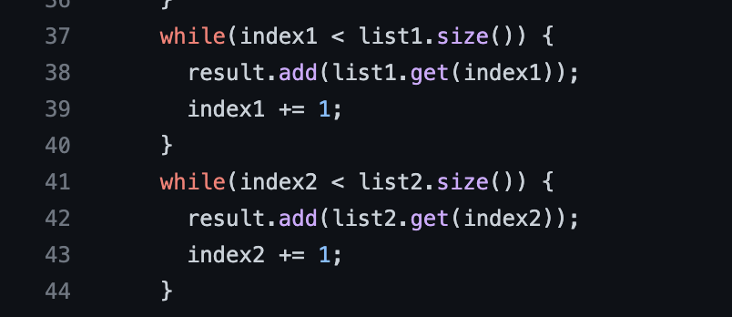

# CSE 15L Week 9 Lab Report by *Addy*

## Labs Done Quick with a bash script

The bash script I wrote is:
---

The result of running the script is:
---

As you can see, the script went through all the steps and the changes appeared on my GitHub repo, changing `index1 += 1` on Line 43 to `index2 += 1`.

## Explanation of the script
---

## Steps 1-3
---
Steps 1-3 is done manually. I deleted the existing fork on my GitHub account and the existing `lab7` directory on my `ieng6` account. The repo can be found at [Lab 7](https://github.com/ucsd-cse15l-w23/lab7).

## Sources Used:
* https://stackoverflow.com/questions/45608019/bash-script-that-will-continue-execution-on-a-remote-server-after-sshing-onto-i
* https://unix.stackexchange.com/questions/587916/using-sed-to-replace-nth-occurrence-of-a-word
