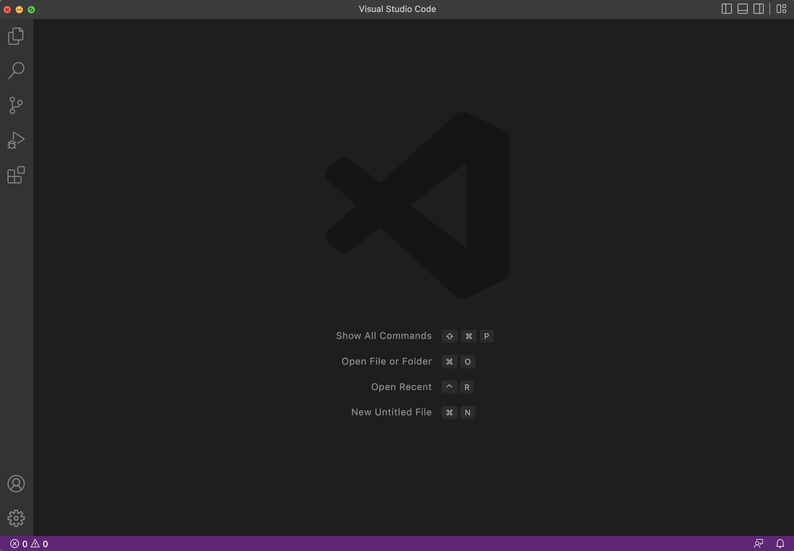
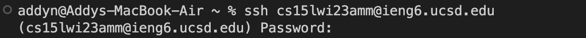
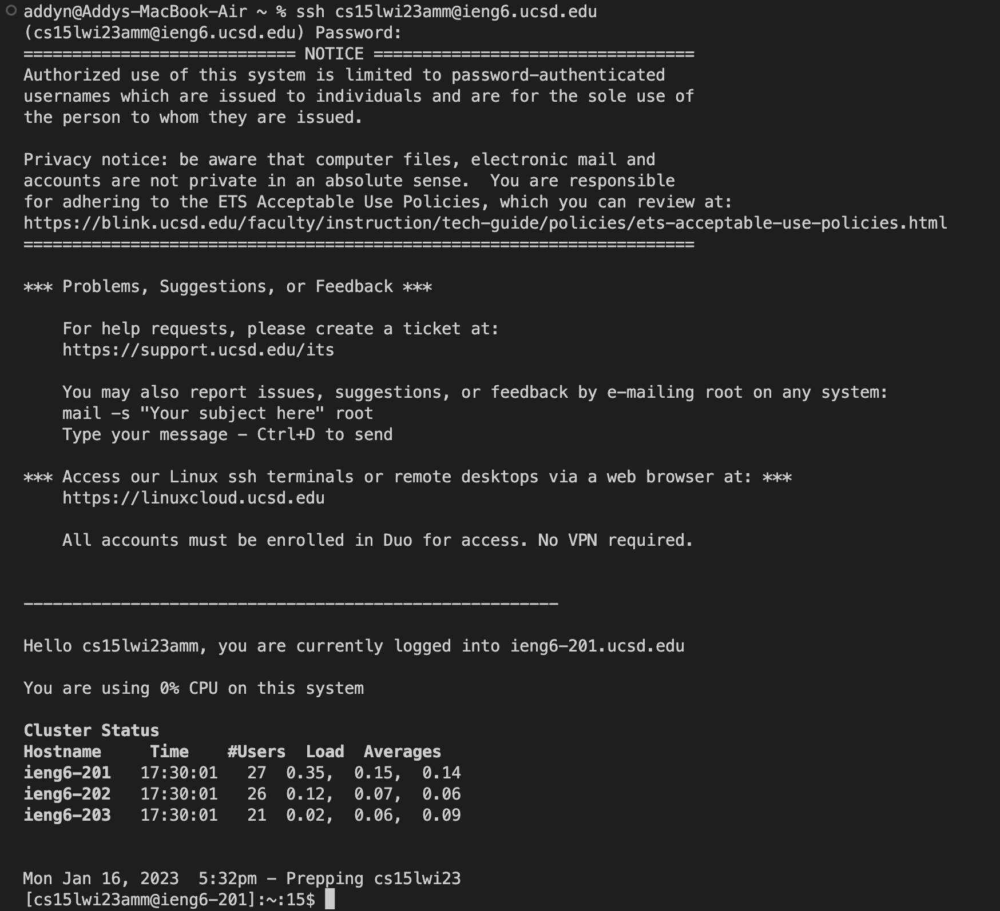
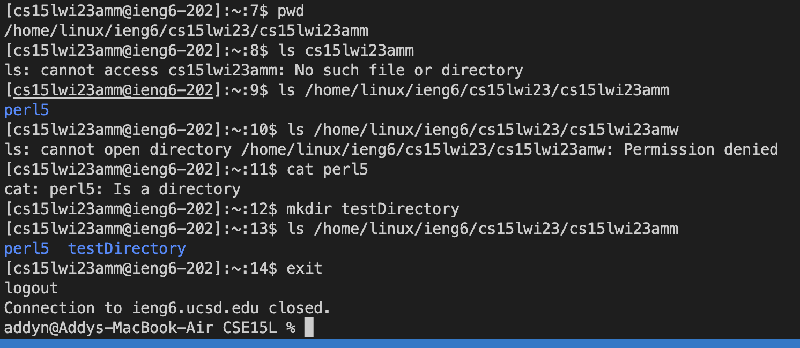

# CSE 15L Week 1 Lab Report

This is a tutorial on how to install Visual Studio Code (VScode) and remotely connect to the remote server.

*By Addy*

# Step 1 - Installing VScode

---

The first step is to install VScode. Since I already had VScode installed on my computer, I skipped this step.

Download the version matching your operating system (Windows, Mac, etc.) at their website: [VScode Website](https://code.visualstudio.com/)

Once downloaded, open VScode and it should look like this (Mac version):

---

# Step 2 - Remotely Connecting

---

## 2.1 - Accesing your CSE15L account
The next step is to remotely connect to the remote server. This requires a CSE15L username and password, which can be found by following the class's provided tutorial at: [Tutorial Link](https://docs.google.com/document/d/1hs7CyQeh-MdUfM9uv99i8tqfneos6Y8bDU0uhn1wqho/edit)

## Important step for Windows users (Skip if Mac) - Installing Git
Since I was on a Mac, I didn't have to do this step, but Windows users have to install [Git](https://gitforwindows.org/) in order to perform the later steps.

After installing [Git](https://gitforwindows.org/), follow the steps at the [tutorial link](https://stackoverflow.com/questions/42606837/how-do-i-use-bash-on-windows-from-the-visual-studio-code-integrated-terminal/50527994#50527994) to setup Git Bash on your VScode terminal.

---

## Connecting to the server (for both Windows and Mac)

* Open up VScode and open the terminal (Git Bash for Windows) with `` Ctrl + ` ``
* In the terminal, type `ssh [accountusername]@ieng6.ucsd.edu` and type in your password

> If it's your first time connecting to the server, it may ask `The authenticity of... Are you sure you want to continue connecting (yes/no/[fingerprint])?`. Enter `yes` to continue then enter your password.
* If everything was done properly, the terminal should look like this:

That means you have successfully connected to the remote server! Continue onto Step 3 to try out commands.

> Some people may encounter an error when entering their password. If you just changed your password, then you may have to wait a few minutes before the password reset works.

---

# Step 3 - Trying Some Commands

---

Now that you've connected to the remote server, it's time to try commands!
Some commands include: `pwd`, `ls`, `cat`, `mkdir`

Below are some of the commands I tried.

`pwd` returns the current working directory

`ls` lists out the folders and files within the desired directory
> In this case, **perl5** is a folder within the directory. 

`cat` prints whatever is in the file
> In this case, perl5 was a folder so cat returned that it was a directory.

`mkdir` creates a new directory
> In this case, I created the directory `testDirectory` which was listed out by `ls`

When you're done with the server, disconnect from the server with `Ctrl + D` or entering `exit`.

That's the end of the tutorial! There are many other commands that can be used.
