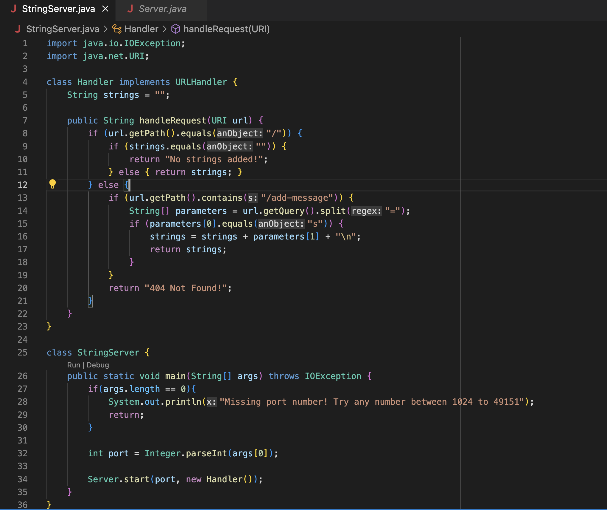

# CSE 15L Week 2 & 3 Lab Report by *Addy*

# Part 1

The web server below is comprised of two files: `StringServer.java` and `Server.java`

**StringServer.java** contains the main method to start the server and the handleRequest method to perform different actions depending on the web server's URL. **Server.java** is a program provided by the CSE 15L tutors with the code required to start an HTTP Server.

---
## Below is the code for `StringServer.java`


---
## Below are the result of two actions utilizing the `/add-message` path

* The methods called are `handleRequest(URI url)`, `getPath()`, `equals()`, `contains()`, `getQuery()`, and `split`.
* The `strings` String value stores the added messages from the URL. 
* `handleRequest` takes in an URI value called url as the argument. In this case: `"localhost:2222/add-message?s=WHAT'S UP"`
* `getPath` gets the path `"/add-message"` as a string value.
* `equals` compares the path to a string argument `"/"`, which represents the default page. It's also used to compare the first parameter value to the string argument `"s"` to check whether the correct query was entered.
* `contains` checks if the path string contains the `"/add-message"` string argument.
* A string array `parameters` is created to store the arguments from the query as a string. The `getQuery` method is used to obtain the query or `"?s=WHAT'S UP"` as a string. Then, `split("=")` is used to separate the string into two strings between the equal sign argument: `"s"` as parameters[0] and `"WHAT'S UP"` as parameters[1].
* The three values that are changed are the `strings` value, `parameters` value, and `url` value. `strings` is an instance variable that starts as an empty string and then concatenates the desired message and a new line `"\n"` when the `"/add-message"` query is called. Currently `strings` is `"WHAT'S UP" + "\n"`. `parameters` and `url` are local variables that depend on the page URL entered. In this case, `parameters` is an array `["s", "WHAT'S UP"]`. 

---

> Since this url calls the same methods, it is similar to the above, but with some different values.

* The methods called are `handleRequest(URI url)`, `getPath()`, `equals()`, `contains()`, `getQuery()`, and `split`.
* The relevant values are `strings`, `parameters`, and `url (argument)`. The relevant constants are the same, `"/" (argument)`, `"/add-message" (argument)`, `"=" (argument)`, `"s" (argument)`, and `"\n"`.
* In this case, the instance variable `strings` is saved from the last add-message call so it is now: `"WHAT's UP" + "\n" + "My name is Bob." + "\n"`. Since `parameters` and `url` are local variables, they are recreated. `parameters` is now `["s", "My name is Bob."]`. `url` is now `"localhost:2222/add-message?s=My name is Bob."`.

# Part 2
## Reversed array bug from ArrayExamples.java
The `reversed(int[] arr)` method has a symptom in which the method doesn't properly reverse an inputted int array.

---
**Failure inducing input**

It fails the JUnit test:
```
@Test
  public void testReversed2() {
    int[] input1 = {1, 2, 3};
    assertArrayEquals(new int[]{3, 2, 1}, ArrayExamples.reversed(input1));
  }
```
in which the input is an int array, `input1 = {1, 2, 3}`.

---
**Passing input**

It passes the JUnit test:
```
@Test
  public void testReversed() {
    int[] input1 = { };
    assertArrayEquals(new int[]{ }, ArrayExamples.reversed(input1));
  }
```
in which the input an empty int array, `input1 = { }`.

---
**Symptoms**

The symptoms are shown below:

As seen in the screenshot, the empty array input passes while the other fails. The symptom of the failing test was that the element at index 0 was `0` instead of `3`.

---
**The Bug**

Before code:
```
static int[] reversed(int[] arr) {
    int[] newArray = new int[arr.length];
    for(int i = 0; i < arr.length; i += 1) {
      arr[i] = newArray[arr.length - i - 1];
    }
    return arr;
  }
```
After code: 
```
static int[] reversed(int[] arr) {
    int[] newArray = new int[arr.length];
    for(int i = 0; i < arr.length; i += 1) {
      newArray[arr.length - i - 1] = arr[i];
    }
    return newArray;
  }
```
---
The before code had a bug causing the resulting array to be an int array of 0s. This is because a new array `newArray` was created with the same length as the inputted array and then the values from `newArray` (starting with highest index) were then assigned to the inputted array (starting from index 0). This would result in an array of only 0s as newArray has default values of 0 since it is an int array. The after code fixes this issue by swapping the new array with the input array within the for loop, and then returning the new array. The for loop assigns the input array's values (starting from index 0) to the new array (counting down from the highest index). 

# Part 3
This lab taught me how to start a webserver and implement different functionality depending on the URL. I learned how to get the path and query and how to run the web server on a remote server.
