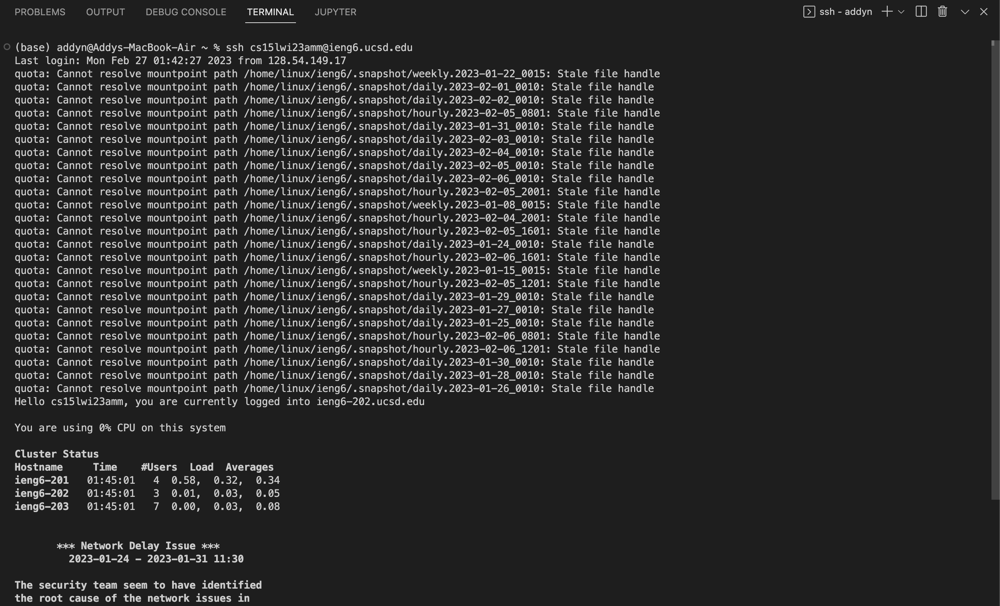
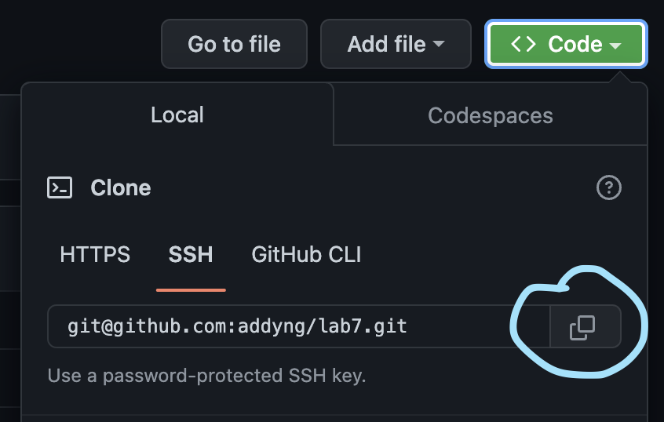

# CSE 15L Week 5 Lab Report by *Addy*

## Practice with editing a file in NANO and using `git`

These instructions assume you have followed the steps for generating an SSH key for ieng6 and generating an SSH key for GitHub. This will make committing and pushing to GitHub easier. If you haven't, the instructions to do so can be found on the CSE 15L website for Week 7 at: [Guide](https://ucsd-cse15l-w23.github.io/week/week7/#github-and-login-command-line-setup)

For the Lab Done Quick challenge, there are 9 steps.
1. **Setup:** Delete any existing forks of the repository you have on your account
2. **Setup:** Fork the repository
3. Start the timer!
4. Log into ieng6
5. Clone your fork of the repository from your Github account
6. Run the tests, demonstrating that they fail
7. Edit the code file to fix the failing test
8. Run the tests, demonstrating that they now succeed
9. Commit and push the resulting change to your Github account

## Steps 1-3
---
For step 1, make sure that there are no existing forks of Lab 7 in your own GitHub account's repositories. Then, make a fresh fork of the repo at [Lab 7](https://github.com/ucsd-cse15l-w23/lab7). This completes the setup for the lab.

## Step 4: Log into ieng6
---
To log into your ieng6 account, the format of your email should be: `cs15l[quarter][year][uniqueID]@ieng6.ucsd.edu`.
For example, mine is: `cs15lwi23amm@ieng6.ucsd.edu`.
The command is: `$ ssh [email]`

Keys pressed: 
* Open terminal: `<CTRL><~>` at the same time
* Type: `ssh <space> cs15lwi23amm@ieng6.ucsd.edu`
> Since I am on MacOS, I didn't have to change my terminal. If you're on Windows, you may have to change your terminal to `Git Bash` in order to login with `ssh`.

## Step 5: Clone your fork of the repository from your Github account
To clone the repository, go to your fork of [Lab 7](https://github.com/ucsd-cse15l-w23/lab7). Click the green button that says `<> Code` and copy the **SSH** clone link under the **local** tab. It should look like this: `git@github.com:[Username]/lab7.git`

Then return back to your terminal. Enter the clone command: `git clone` followed by the copied link.

Keys pressed:
* `git <space> clone <COMMAND><V>`<COMMNAND><V> pastes the copied link. <CTRL><V> if on Windows.

## Step 6: Run the tests, demonstrating that they fail

Keys pressed:
